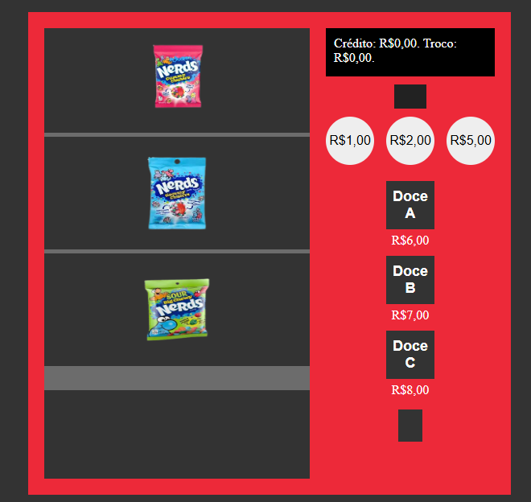
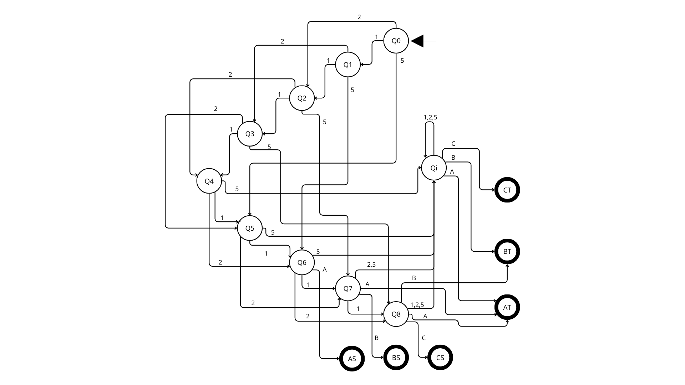

# Máquina de Venda de Doces - Autômato Finito Determinístico (AFD)

 <!-- Adicione uma imagem de preview se disponível -->

## Descrição do Projeto

Este projeto é uma implementação interativa de uma máquina de venda de doces baseada em um Autômato Finito Determinístico (AFD). A máquina permite que os usuários insiram moedas (R$1,00, R$2,00 e R$5,00) e selecionem doces (Doce A por R$6,00, Doce B por R$7,00 e Doce C por R$8,00), com animações que mostram o processo de compra e troco quando aplicável.

## Funcionalidades

- **Inserção de crédito**: Botões para inserir moedas de R$1,00, R$2,00 e R$5,00
- **Seleção de produtos**: Botões para escolher entre Doce A, B ou C
- **Display interativo**: Mostra o crédito atual e o troco
- **Animações**:
  - Queda do doce selecionado
  - Saída do troco em dinheiro

## Tecnologias Utilizadas

- HTML5
- CSS3
- JavaScript (ES6)

## Como Executar

1. Clone este repositório:
   ```bash
   git clone https://github.com/Guilhermeslsand/Case1.git
   
## Representação do Autômato


### Legendas para o Autômato
| Símbolo | Ação                     |
|---------|--------------------------|
| 1       | Inserir uma nota de R$ 1,00 |
| 2       | Inserir uma nota de R$ 2,00 |
| 5       | Inserir uma nota de R$ 5,00 |
| A       | Selecionar o Doce A      |
| B       | Selecionar o Doce B      |
| C       | Selecionar o Doce C      |

| Estado | Significado  |
|---------|--------------------------|
|Q0|Estado Inicial que representa que tem R$ 0,00 de Crédito.|
|Q1|Este é o estado em que a máquina deve se encontrar quando o usuário tiver realizado a ação correspondente à inserção de apenas R$ 1,00.|
|Q2|Este é o estado em que a máquina deve se encontrar quando o usuário tiver inserido uma quantia equivalente a R$ 2,00 na máquina, seja através de qual combinação de moedas for, independentemente do valor das mesmas e da sequência em que foram inseridas.|
|Q3|Este é o estado em que a máquina deve se encontrar quando o usuário tiver inserido uma quantia equivalente a R$ 3,00 na máquina, seja através de qual combinação de moedas for, independentemente do valor das mesmas e da sequência em que foram inseridas.|
|Q4|Este é o estado em que a máquina deve se encontrar quando o usuário tiver inserido uma quantia equivalente a R$ 4,00 na máquina, seja através de qual combinação de moedas for, independentemente do valor das mesmas e da sequência em que foram inseridas.|
|Q5|Este é o estado em que a máquina deve se encontrar quando o usuário tiver inserido uma quantia equivalente a R$ 5,00 na máquina, seja através de qual combinação de moedas for, independentemente do valor das mesmas e da sequência em que foram inseridas.|
|Q6|Este é o estado em que a máquina deve se encontrar quando o usuário tiver inserido uma quantia equivalente a R$ 6,00 na máquina, seja através de qual combinação de moedas for, independentemente do valor das mesmas e da sequência em que foram inseridas.|
|Q7|Este é o estado em que a máquina deve se encontrar quando o usuário tiver inserido uma quantia equivalente a R$ 7,00 na máquina, seja através de qual combinação de moedas for, independentemente do valor das mesmas e da sequência em que foram inseridas.|
|Q8|Este é o estado em que a máquina deve se encontrar quando o usuário tiver inserido uma quantia equivalente a R$ 8,00 na máquina, seja através de qual combinação de moedas for, independentemente do valor das mesmas e da sequência em que foram inseridas.|
|Qi|Este é o estado em que a máquina deve se encontrar quando o usuário tiver inserido uma quantia maior que R$ 8,00.|
|AS|Este estado representa que o cliente conseguiu comprar o doce A, ou seja, deposito dinheiro suficiente no máquina para liberar o doce A e não tem troco para receber.|
|AT|Este estado representa que o cliente conseguiu comprar o doce A, ou seja, deposito dinheiro suficiente no máquina para liberar o doce A e tem troco para receber.|
|BS|Este estado representa que o cliente conseguiu comprar o doce B, ou seja, deposito dinheiro suficiente no máquina para liberar o doce B e não tem troco para receber.|
|BT|Este estado representa que o cliente conseguiu comprar o doce B, ou seja, deposito dinheiro suficiente no máquina para liberar o doce B e tem troco para receber.|
|CS|Este estado representa que o cliente conseguiu comprar o doce C, ou seja, deposito dinheiro suficiente no máquina para liberar o doce C e não tem troco para receber.|
|CT|Este estado representa que o cliente conseguiu comprar o doce C, ou seja, deposito dinheiro suficiente no máquina para liberar o doce C e tem troco para receber.|
